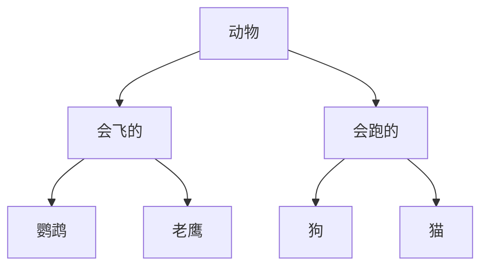

封装、继承和多态只是面向对象程序设计中最基础的3个概念。在Python中，面向对象还有很多高级特性，下面会讨论多重继承、定制类、元类等概念。

<!-- more -->

# 使用 __slots__

正常情况下，可以给一个类的实例创建任何属性和方法，这就是动态语言的灵活性。

```python
class Student(object):
    pass
    
```

绑定属性

```shell
>>> s = Student()
>>> s.name = 'Michael' # 动态给实例绑定一个属性
>>> print(s.name)
Michael

```
也可以绑定一个方法

```shell
>>> def set_age(self, age): # 定义一个函数作为实例方法
...     self.age = age
...
>>> from types import MethodType
>>> s.set_age = MethodType(set_age, s) # 给实例绑定一个方法
>>> s.set_age(25) # 调用实例方法
>>> s.age # 测试结果
25
```
给实例绑定的方法，对另一个实例无效，所以可以绑定到类上。

```shell
>>> def set_score(self, score):
...     self.score = score
...
>>> Student.set_score = set_score
```
通常情况下，上面的`set_score`方法可以直接定义在class中，但动态绑定允许我们在程序运行的过程中动态给class加上功能，这在静态语言中很难实现。

**使用__slots__**

如果我们想要限制实例的属性怎么办？比如，只允许对`Student`实例添加`name`和`age`属性。

为了达到限制的目的，Python允许在定义class的时候，定义一个特殊的`__slots__`变量，来限制该class实例能添加的属性：

`__slots__`定义的属性仅对当前类实例起作用，对继承的子类是不起作用的。子类实例允许定义的属性就是自身的`__slots__`加上父类的`__slots__`。

验证如下:

```python
class Person(object):
    __slots__ = ('name', 'age')

p1 = Person()
p1.name = '张三'

print(p1.name)
# 添加score属性会报错
#p1.score = 10

class Student(Person):
    __slots__ = ('class', 'score')

s1 = Student()

s1.name = '小明'
s1.age = '14'
s1.score = 98

print(s1.name, s1.age, s1.score)

```
# 使用@property

如果给属性加上访问限制，使用get set方法，也可以在赋值时检查数据的合理性。这样操作略显复杂。

Python内置的`@property`装饰器就是负责把一个方法变成属性调用的

把一个getter方法变成属性，只需要加上`@property`就可以了。我们在对实例属性操作的时候，就知道该属性很可能不是直接暴露的，而是通过getter和setter方法来实现的。

```python
class Student(object):

    @property
    def birth(self):
        return self._birth

    @birth.setter
    def birth(self, value):
        self._birth = value

    @property
    def age(self):
        return 2015 - self._birth
```
只定义getter方法，不定义setter方法就是一个只读属性，上面的`birth`是可读写属性，而`age`就是一个只读属性，因为`age`可以根据`birth`和当前时间计算出来。

要特别注意：属性的方法名不要和实例变量重名，下面的就是错误的。

```python
class Student(object):

    # 方法名称和实例变量均为birth:
    @property
    def birth(self):
        return self.birth
```

这是因为调用`s.birth`时，首先转换为方法调用，在执行`return self.birth`时，又视为访问`self`的属性，于是又转换为方法调用，造成无限递归，最终导致栈溢出报错`RecursionError`

# 多重继承


如果是单继承的话，层级结构如下。



如果需要再添加新的继承关系，就会很复杂了， 所以可以采用多重继承的方式。 比如

```python
class Dog(Mammal, Runnable):
    pass
```
通过多重继承，一个子类就可以同时获得多个父类的所有功能。

**MixIn**

在设计类的继承关系时，通常，主线都是单一继承下来的，例如，`Ostrich`继承自`Bird`。但是，如果需要“混入”额外的功能，通过多重继承就可以实现，比如，让`Ostrich`除了继承自`Bird`外，再同时继承`Runnable`。这种设计通常称之为`MixIn`。

MixIn的目的就是给一个类增加多个功能，这样，在设计类的时候，我们优先考虑通过多重继承来组合多个MixIn的功能，而不是设计多层次的复杂的继承关系。

由于Python允许使用多重继承，因此，MixIn就是一种常见的设计。

java中只允许单继承，但是可以通过 implements 多个接口来实现类似的功能。


